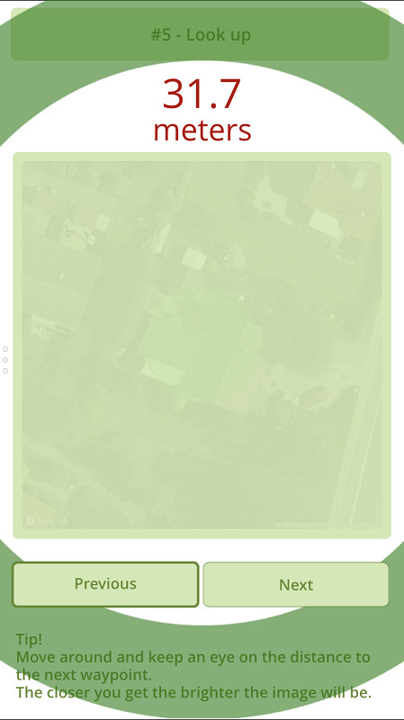
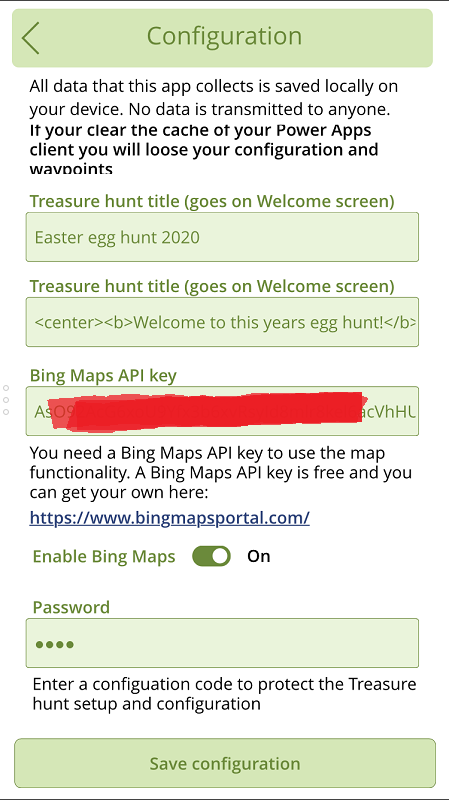

# Power Treasure Hunt

A Power App to manage and facilitate treasure hunts.
No external data source required.
Bing Maps API key optional.

## Description

This is the Power Treasure Hunt App. A Power Apps Canvas app build to manage and facilitatie treasure hunts.

The app is build using only standard features of Canvas Apps. There are no connections to external data sources. The app uses Bing Maps to display sattelite imagery as clues to find waypoints.

Use the app as it is or customize it to your own liking.

## NOTE

The app use the SaveData and LoadData formulas to store and restore app data locally on the device. These formulas are not supported when running Canvas Apps in the browser. Hence, this app only supports Mobile Phone Power Apps Players.

## Installation

Download the Power Treasure Hunt app here [https://github.com/jenschristianschroder/Power-Treasure-Hunt/raw/master/Canvas%20App/PowerTreasureHunt.zip](https://github.com/jenschristianschroder/Power-Treasure-Hunt/raw/master/Canvas%20App/PowerTreasureHunt.zip)

Import it into your Power Platform environment. You can use a Community Plan ([https://powerapps.microsoft.com/en-us/communityplan/](https://powerapps.microsoft.com/en-us/communityplan/)) if you don't have access to Power Platform already.

## Features

### Start the treasure hunt

Start the treasure hunt by clicking Start on the Welcome screen.

### Find clues

Walk around and keep an eye on the distance measurement. It will fluctuate but if you walk around you will be able to pin point the direction to the next clue.

Once you get closer to the clue the image will get brighter.

### Setup waypoints

Add new waypoints to the list of waypoints using the waypoint editor

Use either a photo from camera or your device or use a satellite image of the current location curtesy of Bing Maps (Require a free Bing Maps API key - get yours here: [https://www.bingmapsporta.com](https://www.bingmapsportal.com)

If you use Bing Maps satellite imagery you can use the Pin size slider (left) and Zoom level slider (right) to alter the satellite images.

Enter a title or name for your waypoint. This will be shown when looking for clues so you can use it as a form of help.

Move waypoints up and down in the list to sort the sequence.

When happy with waypoints and sequence click Save waypoints.

### Configuration

Enter the Title of your treasure hunt. This goes on the Welcome screen.

Enter a Descrition of your treasure hunt. This goes on the front screeen. The Description supports simple HTML tags such as &lt;br&gt;, &lt;b&gt;, &lt;center&gt; etc.

Enter the Bing Maps API key if you want to use satellite imagery for waypoint clues. Make sure to enable Bing Maps.

Enter a password to protect the configuration from unintended access.

### Password protection

The Setup and Configuration screens are protected by simple password.

The default password is blank (nothing).

You can configure the password on the configuration screen.

### Enjoy

Enjoy the app as it is or take it apart and but it back together in your own way.
